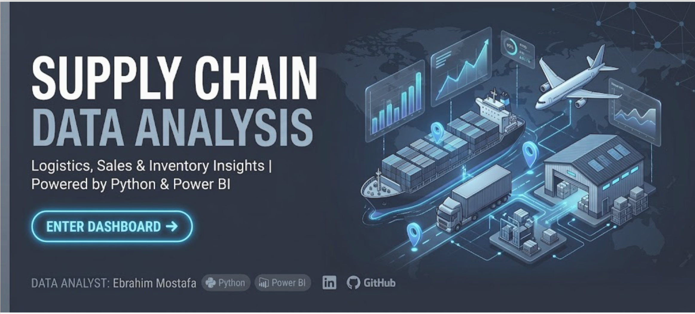
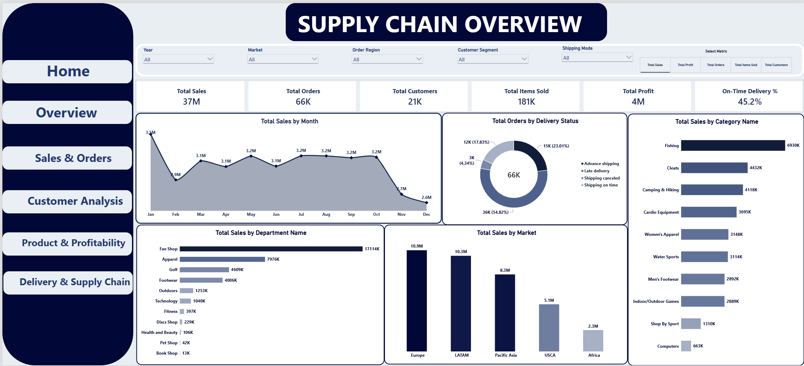
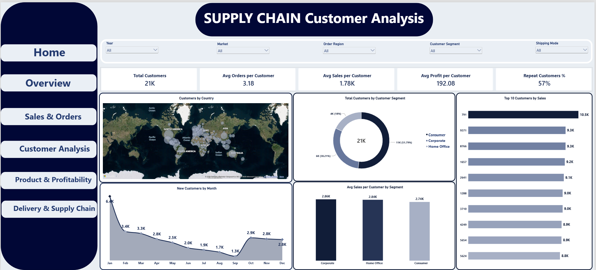
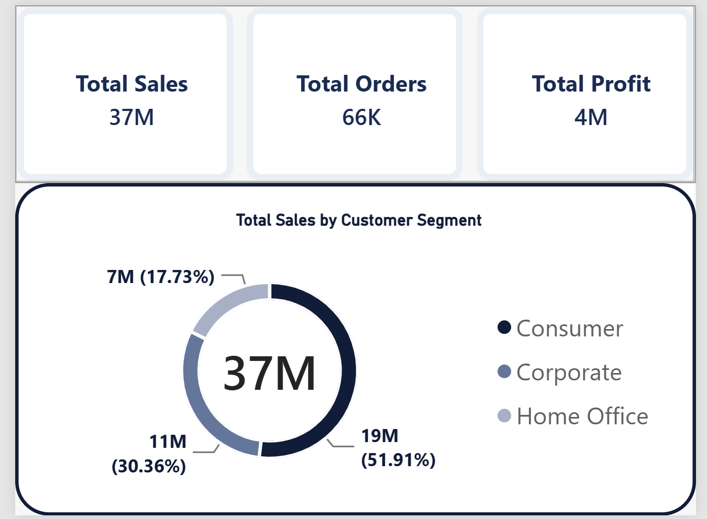

# 🚚 Supply Chain Data Analysis Dashboard

An end-to-end Supply Chain & Logistics Analytics project leveraging **Python** for data cleaning, transformation, and ETL processes, followed by **Power BI** for interactive data visualization, dynamic business intelligence dashboards, and performance monitoring.

---

## 👨‍💻 Project Overview
* **Data Analyst:** Ebrahim Mostafa
* **Tools Used:** Python | Power BI | SQL
* **Project Type:** Supply Chain, Logistics, Sales & Customer Analytics

---

## 📌 Business Objectives & Key Metrics
The goal of this project is to evaluate supply chain efficiency, logistics performance, delivery statuses, product profitability, and customer purchasing behavior to optimize operational workflows and maximize profit margins.

### 📊 Executive KPI Summary:
* **Total Sales:** $37M
* **Total Orders:** 66K
* **Total Customers:** 21K
* **Total Items Sold:** 181K
* **Total Profit:** $4M
* **Profit Margin %:** 11%
* **On-Time Delivery %:** 45.2%
* **Late Delivery %:** 55%
* **Average Order Value (AOV):** $559

---

## 🗺️ Dashboard Structure & Pages

### 1. 🏠 Home Page
* **Purpose:** High-impact visual landing page providing seamless navigation across all dashboard sections.
* **Key Features:**
  * Clean UI dark layout featuring project title and core tech stack (Python & Power BI).
  * Direct interactive buttons to jump into Overview, Sales & Orders, Customer Analysis, Product & Profitability, and Delivery & Supply Chain pages.
  * Direct developer contact links (LinkedIn & GitHub).

---

### 2. 📊 Overview Page
* **Purpose:** High-level executive overview of global business performance and high-impact operational metrics.
* **Key Visuals & Metrics:**
  * **Top KPIs:** Total Sales ($37M), Total Orders (66K), Total Customers (21K), Items Sold (181K), Total Profit ($4M), On-Time Delivery % (45.2%).
  * **Total Sales by Month:** Line chart tracking monthly revenue trends, highlighting peak sales in early/mid-year and decline in Q4.
  * **Total Orders by Delivery Status:** Donut chart showing Late delivery (36K / 54.82%), Advance shipping (15K / 23.01%), Shipping on time (12K / 17.83%), and Shipping canceled (3K / 4.34%).
  * **Total Sales by Department Name:** Horizontal bar chart identifying Fan Shop ($17,114K) and Apparel ($7,976K) as top revenue generators.
  * **Total Sales by Market:** Regional bar chart showing Europe ($10.9M) and LATAM ($10.3M) leading global sales.
  * **Total Sales by Category Name:** Category performance led by Fishing ($6,930K) and Cleats ($4,432K).

---

### 3. 📦 Sales & Orders Page
* **Purpose:** Deep dive into order volumes, average order values, shipping class distributions, and customer segment revenue contribution.
* **Key Visuals & Metrics:**
  * **KPI Summary Cards:** Total Sales ($37M), Total Orders (66K), Average Order Value ($559), Total Profit ($4M), Profit Margin % (11%).
  * **Total Orders by Shipping Mode:** Volume distribution across Standard Class (39K), Second Class (13K), First Class (10K), and Same Day (4K).
  * **Average Order Value by Month:** Trend line showing monthly AOV variations, ranging from $587–$613 mid-year to $457 in Q4.
  * **Total Sales by Customer Segment:** Donut chart showing Consumer segment driving $19M (51.91%), Corporate driving $11M (30.36%), and Home Office driving $7M (17.73%).
  * **Top 5 Profit Margin % by Category Name:** Profitability rankings led by Golf Bags & Carts (17%).
  * **Total Profit by Department Name:** Profit breakdown per department with Fan Shop generating $1,834K.

---

### 4. 👥 Customer Analysis Page
* **Purpose:** Comprehensive analysis of customer demographics, retention rates, acquisition trends, and purchasing patterns.
* **Key Visuals & Metrics:**
  * **Customer KPIs:** Total Customers (21K), Avg Orders per Customer (3.18), Avg Sales per Customer ($1.78K), Avg Profit per Customer ($192.08), Repeat Customers % (57%).
  * **Customers by Country:** Global geographic map visualizing customer density across regions.
  * **New Customers by Month:** Acquisition trend tracking initial peak of 6.4K customers in January and steady user adoption over time.
  * **Total Customers by Customer Segment:** Distribution across Consumer, Corporate, and Home Office categories.
  * **Avg Sales per Customer by Segment:** Highlighting consistent spending power across segments ($2.86K to $2.74K).
  * **Top 10 Customers by Sales:** Identification of highest-value individual customers.

---

### 5. 💰 Product & Profitability Page
* **Purpose:** Financial performance evaluation focused on category margins, shipping mode profits, and top profit-generating inventory.
* **Key Visuals & Metrics:**
  * **Financial KPIs:** Total Profit ($4M), Profit Margin % (11%), Total Items Sold (181K), Avg Discount (10%), Loss-making Products % (3%).
  * **Profit by Shipping Mode:** Profitability breakdown per shipping option, with Standard Class contributing $2,370K.
  * **Profit by Market:** Doughnut chart detailing market profit contributions led by Europe ($1,169K / 29.48%) and LATAM ($1,123K / 28.32%).
  * **Total Profit by Category:** Category funnel ranking led by Fishing ($756K) and Cleats ($494K).
  * **Total Profit by Department Name:** Treemap chart showing relative department profitability led by Fan Shop ($1,834K) and Apparel ($882K).
  * **Top 10 Products by Profit:** Individual product leaderboards led by *Field & Stream Sportsman 16 Gun Fire Safe* ($756K).

---

### 6. 🚚 Delivery & Supply Chain Page
* **Purpose:** Monitoring supply chain logistics, identifying delivery delays, evaluating vendor performance, and detecting fulfillment bottlenecks.
* **Key Visuals & Metrics:**
  * **Logistics KPIs:** On-Time Delivery % (45.2%), Late Delivery % (55%), Avg Scheduled Days (2.93), Avg Delay Days (0.57), Canceled Orders %.
  * **Avg Delay Days by Month:** Monthly delivery delay duration tracking (averaging 0.55–0.58 days delay).
  * **Delivery Status by Shipping Mode:** Stacked bar chart showing fulfillment rates, highlighting high delay rates in First Class (95.27%) and Second Class (76.72%).
  * **Actual vs Scheduled Days:** Comparison across shipping classes (e.g., Standard Class scheduled vs actual transit time).
  * **Late Delivery % by Market:** Regional delay identification with Pacific Asia (55.30%) and Europe (54.95%) exhibiting highest late rates.
  * **Late Delivery % by Department:** Departmental delay bottleneck analysis led by Pet Shop (58.94%) and Book Shop (56.54%).

---

### 7. 💡 Dynamic Tooltips Page
* **Purpose:** Custom interactive hover tooltips embedded across report visuals to provide quick context summaries without navigating away from active dashboards.
* **Key Visuals:** Summary cards for Total Sales ($37M), Total Orders (66K), Total Profit ($4M), and Customer Segment percentage splits.

---

## 💡 Recommendations & Actionable Insights (التوصيات الإستراتيجية)

1. **معالجة ارتفاع نسبة تأخير التوصيل (Late Delivery Rate):**
   * تصل نسبة التأخير في التسليم إلى **55%**، وهو معدل مرتفع جداً يتطلب مراجعة فورية لاتفاقيات مستوى الخدمة (SLAs) مع شركات الشحن والتوصيل.
   * التركيز على تحسين عمليات التوصيل في الأسواق الأكثر تأثراً بالتأخير، وخاصة منطقتي **Pacific Asia (55.30%)** و **Europe (54.95%)**.
   * إعادة معالجة وإعادة تنظيم خطوط الشحن والتأخير المرتفع في أقسام مثل **Pet Shop (58.94%)** و **Book Shop (56.54%)**.

2. **تحسين استراتيجيات طرق الشحن (Shipping Modes):**
   * يعتمد معظم العملاء على الشحن القياسي (**Standard Class**) بحجم طلبات يصل إلى 39K طلب. يجب إعادة توزيع الضغط التشغيلي أو تحفيز العملاء لاستخدام طرق شحن أسرع وأكثر كفاءة.
   * خيار الشحن في نفس اليوم (**Same Day**) يعاني من معدلات إلغاء وتأخير مرتفعة نسبياً مقارنة بحجمه الصغير، مما يتطلب تقييم الجدوى التشغيلية له.

3. **التركيز على القطاعات والفئات الأكثر إيراداً وربحية:**
   * قطاع الأفراد (**Consumer**) يمثل النسبة الأكبر بـ **51.91%** من إجمالي المبيعات بقيمة **19M**، لذا يُوصى بتوجيه حملات تسويقية وبرامج ولاء مخصصة لهذا القطاع.
   * قسم **Fan Shop** يتصدر باقي الأقسام بمبيعات **17,114K** وأرباح **1,834K**، بينما فئة **Fishing** تتصدر الفئات بمبيعات **6,930K** وأرباح **756K**؛ مما يوجب التأكد الدائم من توفر مخزونها وتجنب أي انقطاع.

4. **إعادة هيكلة المنتجات والأقسام ذات الأداء المنخفض:**
   * أقسام مثل **Book Shop** (مبيعات 13K / أرباح 1K) و **Pet Shop** (مبيعات 42K / أرباح 4K) تحقق عوائد ضئيلة جداً لا تتناسب مع تكاليف التشغيل والتوصيل، مما يقتضي إعادة النظر في تسعيرها أو جدوى استمرارها.
   * الحد من التكاليف التشغيلية الناتجة عن المنتجات الخاسرة التي تشكل **3%** من إجمالي المنتجات (**Loss-making Products**).

5. **معالجة الانخفاض الموسمي في الربع الأخير (Q4):**
   * يلاحظ انخفاض ملحوظ في متوسط قيمة الطلب (**Average Order Value**) وإجمالي المبيعات خلال شهري **نوفمبر وديسمبر**. يُوصى بتجهيز عروض وتخفيضات موسمية وحزم منتجات (Bundles) لرفع متوسط قيمة السلة خلال نهاية العام.

---

## 🛠️ How to Run / Open the Dashboard
1. Execute Python data prep scripts if re-processing raw datasets.
2. Download the `.pbix` file from this repository.
3. Open using **Microsoft Power BI Desktop**.
4. Use the **Home Page** dynamic buttons or sidebar navigation to explore all interactive pages.
